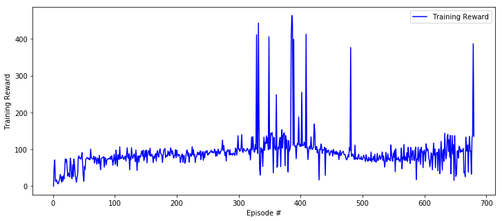
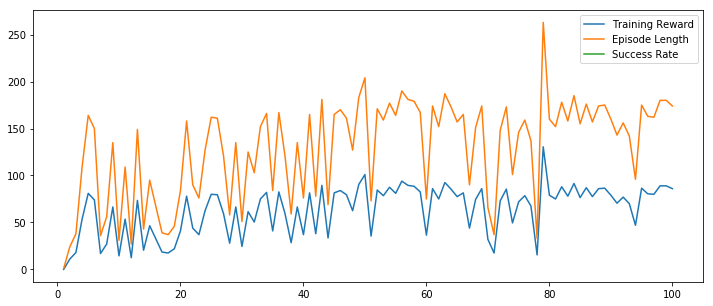
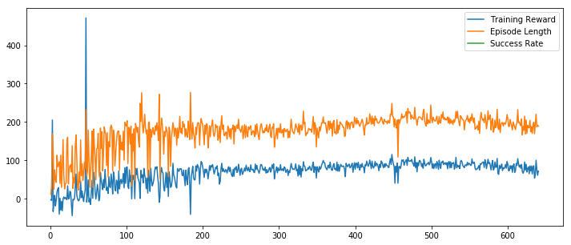
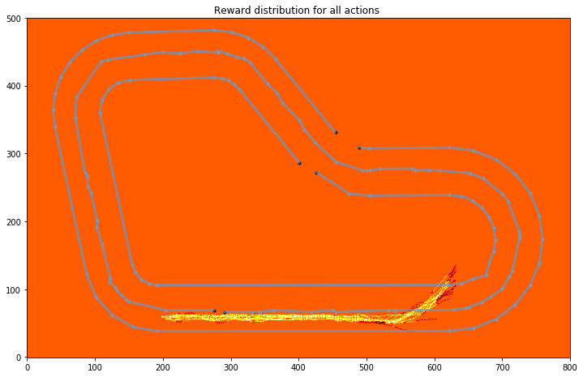

# Training 01 - Negative Reward For Distance-from-center

```python
    def reward_function(...):
        
        if not on_track:
            print('not on track', on_track)
            return -1
        
        print('default reward', -1 * distance_from_center)
        return -1 * distance_from_center
```



데모: 

1. 완료
2. 70%
3. 완료
4. 70%
5. 완료
6. 70%
7. 완료

```
Waiting for s3://sagemaker-us-east-1-571175237970/rl-deepracer-sagemaker-190309-151341/output/intermediate/worker_0.simple_rl_graph.main_level.main_level.agent_0.csv...
Downloading rl-deepracer-sagemaker-190309-151341/output/intermediate/worker_0.simple_rl_graph.main_level.main_level.agent_0.csv
```

# Train 02 - Zero Reward

```
    def reward_function(...):
        return 0
```




# Train 03

실제 돌려봐도 안돌아감

```python
    def reward_function(...):

        msg = '[Anderson] on_track:{0} | xy:{1},{2} | dist:{3} | progress:{4} | steps:{5} | throttle:{6} | st:{7} | width:{8} | waypnt:9} | clswp:{10} | '.format(
               on_track, x, y, round(distance_from_center, 2), round(progress, 2), steps, 
               throttle, steering, track_width, waypoints, closest_waypoints)
        
        if not hasattr(self, '_max_progress'):
            self._max_progress = 0
           
        if self._max_progress < progress:
            print(msg, 'Max Progress')
            self._max_progress = progress
            return progress
        
        if progress >= 100:
            print(msg, 'Done')
            return 100
        
        if not on_track:
            print(msg, 'NOT ON Track')
            return -10
        
        if distance_from_center > 0.05:
            print(msg, 'Distance From Center')
            return -1
        
        print(msg, 'Default')
        return 0
```






# Train 04

```
    def reward_function(...):
        msg = '[Anderson] on_track:{0} | xy:{1},{2} | dist:{3} | progress:{4} | steps:{5} | throttle:{6} | st:{7} | width:{8} | waypnt:{9} | clswp:{10} | '.format(
               on_track, x, y, round(distance_from_center, 2), round(progress, 2), steps, 
               throttle, steering, track_width, len(waypoints), closest_waypoints)
        
        if not hasattr(self, '_max_progress'):
            self._max_progress = 0
           
        if self._max_progress < progress:
            print(msg, 'Max Progress')
            self._max_progress = progress
            return 1
        
        if progress >= 100:
            print(msg, 'Done')
            return 1
        
        if not on_track:
            print(msg, 'NOT ON Track')
            return -2
        
        if distance_from_center > 0.05:
            print(msg, 'Distance From Center')
            return -1
        
        print(msg, 'Default')
        return 0
```

# Train 04

```
    def reward_function(...):
        
        msg = '[Anderson][04] on_track:{0} | xy:{1},{2} | dist:{3} | progress:{4} | steps:{5} | throttle:{6} | st:{7} | width:{8} | waypnt:{9} | clswp:{10} | '.format(
               on_track, x, y, round(distance_from_center, 2), round(progress, 2), steps, 
               throttle, steering, track_width, len(waypoints), closest_waypoints)
        
        if not hasattr(self, '_max_progress'):
            self._max_progress = 0
           
        if self._max_progress < progress:
            print(msg, 'Max Progress')
            self._max_progress = progress
            return 1
        
        if not on_track:
            print(msg, 'NOT ON Track')
            return -2
        
        if distance_from_center > 0.05:
            print(msg, 'Distance From Center')
            return -1
        
        if throttle < 0.7 and progress > 5:
            print(msg, 'Too Slow')
            return -1
        
        print(msg, 'Default')
        return 0
```

