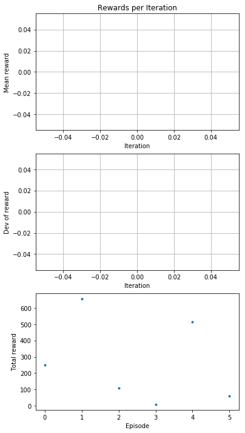

# Training 01 - Negative Reward For Distance-from-center

```python
    def reward_function(...):
        
        if not on_track:
            print('not on track', on_track)
            return -1
        
        print('default reward', -1 * distance_from_center)
        return -1 * distance_from_center
```


데모: 

1. 완료
2. 70%
3. 완료
4. 70%
5. 완료
6. 70%
7. 완료

```
Waiting for s3://sagemaker-us-east-1-571175237970/rl-deepracer-sagemaker-190309-151341/output/intermediate/worker_0.simple_rl_graph.main_level.main_level.agent_0.csv...
Downloading rl-deepracer-sagemaker-190309-151341/output/intermediate/worker_0.simple_rl_graph.main_level.main_level.agent_0.csv
```

# Train 02 - Zero Reward

```
    def reward_function(...):
        return 0
```


# Train 03

실제 돌려봐도 안돌아감

```python
    def reward_function(...):

        msg = '[Anderson] on_track:{0} | xy:{1},{2} | dist:{3} | progress:{4} | steps:{5} | throttle:{6} | st:{7} | width:{8} | waypnt:9} | clswp:{10} | '.format(
               on_track, x, y, round(distance_from_center, 2), round(progress, 2), steps, 
               throttle, steering, track_width, waypoints, closest_waypoints)
        
        if not hasattr(self, '_max_progress'):
            self._max_progress = 0
           
        if self._max_progress < progress:
            print(msg, 'Max Progress')
            self._max_progress = progress
            return progress
        
        if progress >= 100:
            print(msg, 'Done')
            return 100
        
        if not on_track:
            print(msg, 'NOT ON Track')
            return -10
        
        if distance_from_center > 0.05:
            print(msg, 'Distance From Center')
            return -1
        
        print(msg, 'Default')
        return 0
```


# Train 04

돌아감. 1바퀴 돌고.. 반바퀴 더 돌때쯤 멈춤. 일단 됨

문제는.. 속도에 대한 보상이 없었으며 progress가 100이 넘어간후 계속 돌때 계속 1점씩 주기 때문에.. 사실은 게임이 완료 되었지만.. 한바퀴 돌고난 이후에 돌때.. 잘못된 행동에도 리워드가 주어졌음. 

[Video 확인](data/03-validation.mp4)

```python
    def reward_function(...):
        msg = '[Anderson] on_track:{0} | xy:{1},{2} | dist:{3} | progress:{4} | steps:{5} | throttle:{6} | st:{7} | width:{8} | waypnt:{9} | clswp:{10} | '.format(
               on_track, x, y, round(distance_from_center, 2), round(progress, 2), steps, 
               throttle, steering, track_width, len(waypoints), closest_waypoints)
        
        if not hasattr(self, '_max_progress'):
            self._max_progress = 0
           
        if self._max_progress < progress:
            print(msg, 'Max Progress')
            self._max_progress = progress
            return 1
        
        if progress >= 100:
            print(msg, 'Done')
            return 1
        
        if not on_track:
            print(msg, 'NOT ON Track')
            return -2
        
        if distance_from_center > 0.05:
            print(msg, 'Distance From Center')
            return -1
        
        print(msg, 'Default')
        return 0
```




# Train 05 - Slow Speed & 180 Reward

0.7보다 속도가 떨어질때마다 -1 reward를 주었음. 

또한 progress가 180이상으로 갔을때만 reward 1 값을 주었음. 

잘 안됨. 잘 안돌아감.

```python
    def reward_function(self, on_track, x, y, distance_from_center, car_orientation, progress, steps,
                        throttle, steering, track_width, waypoints, closest_waypoints):
        
        msg = '[Anderson][04] on_track:{0} | xy:{1},{2} | dist:{3} | progress:{4} | steps:{5} | throttle:{6} | st:{7} | width:{8} | waypnt:{9} | clswp:{10} | '.format(
               on_track, x, y, round(distance_from_center, 2), round(progress, 2), steps, 
               throttle, steering, track_width, len(waypoints), closest_waypoints)
        
        if not hasattr(self, '_max_progress'):
            self._max_progress = 0
        
        if not on_track:
            print(msg, 'NOT ON Track')
            return -2
        
        if distance_from_center > 0.05:
            print(msg, 'Distance From Center')
            return -1-distance_from_center
        
        if throttle < 0.7 and progress > 5:
            print(msg, 'Too Slow')
            return -1
        
        if self._max_progress < progress:
            print(msg, 'Max Progress')
            self._max_progress = progress
            return 1
        
        if progress > 180:
            print(msg, 'Progress 180')
            return 1
        
        print(msg, 'Default')
        return 1e-3
```

### Training


# Train 06 

```python
    def reward_function(self, on_track, x, y, distance_from_center, car_orientation, progress, steps,
                        throttle, steering, track_width, waypoints, closest_waypoints):
        
        msg = '[Anderson][04] on_track:{0} | xy:{1},{2} | dist:{3} | progress:{4} | steps:{5} | throttle:{6} | st:{7} | width:{8} | waypnt:{9} | clswp:{10} | '.format(
               on_track, x, y, round(distance_from_center, 2), round(progress, 2), steps, 
               throttle, steering, track_width, len(waypoints), closest_waypoints)
        
        if not hasattr(self, '_max_progress'):
            self._max_progress = 0
        
        if not on_track:
            print(msg, 'NOT ON Track')
            return -3
        
        if distance_from_center > 0.05:
            print(msg, 'Distance From Center')
            return - (distance_from_center + 0.5)

        if self._max_progress < progress:
            print(msg, 'Max Progress')
            self._max_progress = progress
            return 1
        
        if progress > 100:
            print(msg, 'progress 100')
            return 1
        
        if throttle < 0.7 and progress > 5:
            print(msg, 'Too Slow')
            return throttle - 1
        
        print(msg, 'Default')
        return 0
```


# Train 07

초기 eval의 경우 한바퀴는 잘 돌고 그 후 실패하는 경향을 보이다가 추가 eval의 경우 실패

```python
  def reward_function(self, on_track, x, y, distance_from_center, car_orientation, progress, steps,
                        throttle, steering, track_width, waypoints, closest_waypoints):
        if distance_from_center >= 0.0 and distance_from_center <= 0.02:
            return 1.0
        elif distance_from_center >= 0.02 and distance_from_center <= 0.03:
            return 0.3
        elif distance_from_center >= 0.03 and distance_from_center <= 0.05:
            return 0.1
        return 1e-3  # like crashed
```

### Training


### Evaluation


