# Training 01 - Negative Reward For Distance-from-center

```python
    def reward_function(...):
        
        if not on_track:
            print('not on track', on_track)
            return -1
        
        print('default reward', -1 * distance_from_center)
        return -1 * distance_from_center
```


데모: 

1. 완료
2. 70%
3. 완료
4. 70%
5. 완료
6. 70%
7. 완료

```
Waiting for s3://sagemaker-us-east-1-571175237970/rl-deepracer-sagemaker-190309-151341/output/intermediate/worker_0.simple_rl_graph.main_level.main_level.agent_0.csv...
Downloading rl-deepracer-sagemaker-190309-151341/output/intermediate/worker_0.simple_rl_graph.main_level.main_level.agent_0.csv
```

# Train 02 - Zero Reward

```
    def reward_function(...):
        return 0
```


# Train 03

실제 돌려봐도 안돌아감

```python
    def reward_function(...):

        msg = '[Anderson] on_track:{0} | xy:{1},{2} | dist:{3} | progress:{4} | steps:{5} | throttle:{6} | st:{7} | width:{8} | waypnt:9} | clswp:{10} | '.format(
               on_track, x, y, round(distance_from_center, 2), round(progress, 2), steps, 
               throttle, steering, track_width, waypoints, closest_waypoints)
        
        if not hasattr(self, '_max_progress'):
            self._max_progress = 0
           
        if self._max_progress < progress:
            print(msg, 'Max Progress')
            self._max_progress = progress
            return progress
        
        if progress >= 100:
            print(msg, 'Done')
            return 100
        
        if not on_track:
            print(msg, 'NOT ON Track')
            return -10
        
        if distance_from_center > 0.05:
            print(msg, 'Distance From Center')
            return -1
        
        print(msg, 'Default')
        return 0
```


# Train 04 - 일단 됨

돌아감. 1바퀴 돌고.. 반바퀴 더 돌때쯤 멈춤. 일단 됨

문제는.. 속도에 대한 보상이 없었으며 progress가 100이 넘어간후 계속 돌때 계속 1점씩 주기 때문에.. 사실은 게임이 완료 되었지만.. 한바퀴 돌고난 이후에 돌때.. 잘못된 행동에도 리워드가 주어졌음. 

[Video 확인](data/03-validation.mp4)

```python
    def reward_function(...):
        msg = '[Anderson] on_track:{0} | xy:{1},{2} | dist:{3} | progress:{4} | steps:{5} | throttle:{6} | st:{7} | width:{8} | waypnt:{9} | clswp:{10} | '.format(
               on_track, x, y, round(distance_from_center, 2), round(progress, 2), steps, 
               throttle, steering, track_width, len(waypoints), closest_waypoints)
        
        if not hasattr(self, '_max_progress'):
            self._max_progress = 0
           
        if self._max_progress < progress:
            print(msg, 'Max Progress')
            self._max_progress = progress
            return 1
        
        if progress >= 100:
            print(msg, 'Done')
            return 1
        
        if not on_track:
            print(msg, 'NOT ON Track')
            return -2
        
        if distance_from_center > 0.05:
            print(msg, 'Distance From Center')
            return -1
        
        print(msg, 'Default')
        return 0
```


# Train 05 - Slow Speed & 180 Reward

0.7보다 속도가 떨어질때마다 -1 reward를 주었음. 

또한 progress가 180이상으로 갔을때만 reward 1 값을 주었음. 

잘 안됨. 잘 안돌아감.

```python
    def reward_function(self, on_track, x, y, distance_from_center, car_orientation, progress, steps,
                        throttle, steering, track_width, waypoints, closest_waypoints):
        
        msg = '[Anderson][04] on_track:{0} | xy:{1},{2} | dist:{3} | progress:{4} | steps:{5} | throttle:{6} | st:{7} | width:{8} | waypnt:{9} | clswp:{10} | '.format(
               on_track, x, y, round(distance_from_center, 2), round(progress, 2), steps, 
               throttle, steering, track_width, len(waypoints), closest_waypoints)
        
        if not hasattr(self, '_max_progress'):
            self._max_progress = 0
        
        if not on_track:
            print(msg, 'NOT ON Track')
            return -2
        
        if distance_from_center > 0.05:
            print(msg, 'Distance From Center')
            return -1-distance_from_center
        
        if throttle < 0.7 and progress > 5:
            print(msg, 'Too Slow')
            return -1
        
        if self._max_progress < progress:
            print(msg, 'Max Progress')
            self._max_progress = progress
            return 1
        
        if progress > 180:
            print(msg, 'Progress 180')
            return 1
        
        print(msg, 'Default')
        return 1e-3
```

### Training

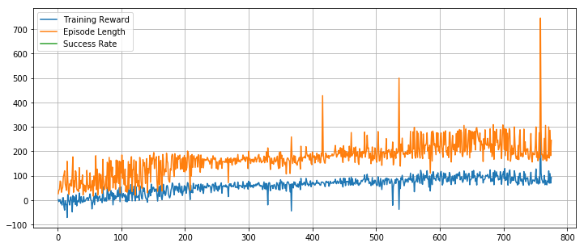


# Train 06 - 개 안됨

자동차는 좌우로 이리저리 흔들리고, 첫번째 커브에서 밖으로 그냥 튀어나감. 

개안됨. 아마도 속도에다가 reward를 줘서 그런가. 확인 필요함

[동영상](data/06-validation-fail.mp4)

```python
    def reward_function(self, on_track, x, y, distance_from_center, car_orientation, progress, steps,
                        throttle, steering, track_width, waypoints, closest_waypoints):
        
        msg = '[Anderson][04] on_track:{0} | xy:{1},{2} | dist:{3} | progress:{4} | steps:{5} | throttle:{6} | st:{7} | width:{8} | waypnt:{9} | clswp:{10} | '.format(
               on_track, x, y, round(distance_from_center, 2), round(progress, 2), steps, 
               throttle, steering, track_width, len(waypoints), closest_waypoints)
        
        if not hasattr(self, '_max_progress'):
            self._max_progress = 0
        
        if not on_track:
            print(msg, 'NOT ON Track')
            return -3
        
        if distance_from_center > 0.05:
            print(msg, 'Distance From Center')
            return - (distance_from_center + 0.5)

        if self._max_progress < progress:
            print(msg, 'Max Progress')
            self._max_progress = progress
            return 1
        
        if progress > 100:
            print(msg, 'progress 100')
            return 1
        
        if throttle < 0.7 and progress > 5:
            print(msg, 'Too Slow')
            return throttle - 1
        
        print(msg, 'Default')
        return 0
```


# Train 07 - 기본값. 

초기 eval의 경우 한바퀴는 잘 돌고 그 후 실패하는 경향을 보이다가 추가 eval의 경우 실패

두번째 돌렸는데.. ㅠㅠ 이걸 이기는게 어려움. 

```python
  def reward_function(self, on_track, x, y, distance_from_center, car_orientation, progress, steps,
                        throttle, steering, track_width, waypoints, closest_waypoints):
        if distance_from_center >= 0.0 and distance_from_center <= 0.02:
            return 1.0
        elif distance_from_center >= 0.02 and distance_from_center <= 0.03:
            return 0.3
        elif distance_from_center >= 0.03 and distance_from_center <= 0.05:
            return 0.1
        return 1e-3  # like crashed
```

### Training


두번째 돌려봄


[Training Simulation Job](https://us-east-1.console.aws.amazon.com/robomaker/home?region=us-east-1#simulationJobs/sim-9djwrcj0wnbd)

[Training Log](https://console.aws.amazon.com/cloudwatch/home?region=us-east-1#logStream:group=/aws/robomaker/SimulationJobs;prefix=sim-9djwrcj0wnbd;streamFilter=typeLogStreamPrefix)


### Evaluation


# Train 08 - 개안됨

잘 안돌아간다. 

안됨 안됨 안됨 안됨

```python
    def reward_function(self, on_track, x, y, distance_from_center, car_orientation, progress, steps,
                        throttle, steering, track_width, waypoints, closest_waypoints):
        
        msg = '[Anderson][04] on_track:{0} | xy:{1},{2} | dist:{3} | progress:{4} | steps:{5} | throttle:{6} | st:{7} | width:{8} | waypnt:{9} | clswp:{10} | '.format(
               on_track, x, y, round(distance_from_center, 2), round(progress, 2), steps, 
               throttle, steering, track_width, len(waypoints), closest_waypoints)
        
        if not hasattr(self, '_max_progress'):
            print('SET MAX PROGRESS')
            self._max_progress = 0
        
        if not on_track:
            print(msg, 'NOT ON Track -1')
            return -1
        
        if self._max_progress < progress and progress >= 100:
            print(msg, 'Max Progress 1')
            self._max_progress = progress
            return 1
        
        if distance_from_center >= 0.0 and distance_from_center <= 0.02:
            print(msg, 'Good Distance 1.0')
            return 1.0
        elif distance_from_center >= 0.02 and distance_from_center <= 0.03:
            print(msg, 'Good Distance 0.3')
            return 0.3
        elif distance_from_center >= 0.03 and distance_from_center <= 0.05:
            print(msg, 'Good Distance 0.1')
            return 0.1
        
        if progress > 100 and progress < 110:
            print(msg, 'progress 100 ~ 110')
            return 1
        
        print(msg, 'Default', -distance_from_center)
        return -distance_from_center
```

### Training


### Evaluation


# Train 09 - 인터넷에서 찾은거. 개안됨

참고는 해볼수 있다. 잘 안된다.. 돌기도 하고.. 대부분.. 탈선. 

```python
def reward_function(self, on_track, x, y, distance_from_center, car_orientation, progress, steps,
                    throttle, steering, track_width, waypoints, closest_waypoints):
    
    msg = '[Anderson][04] on_track:{0} | xy:{1},{2} | dist:{3} | progress:{4} | steps:{5} | throttle:{6} | st:{7} | width:{8} | waypnt:{9} | clswp:{10} | '.format(
           on_track, x, y, round(distance_from_center, 2), round(progress, 2), steps, 
           throttle, steering, track_width, len(waypoints), closest_waypoints)
    
    import math
    from statistics import mean

    ##########
    # Settings
    ##########
    # Min / Max Reward
    REWARD_MIN = -1e5
    REWARD_MAX = 1e5
    # Define the Area each side of the center that the card can use.
    # Later version might consider adjust this so that it can hug corners
    CENTER_LANE = track_width * .25
    HALF_TRACK = track_width / 2

    ABS_STEERING_THRESHOLD = .85

    ####################
    # Locations on track
    ####################

    # Set Base Reward
    if not on_track: # Fail them if off Track
        reward = REWARD_MIN
        return reward
    elif progress == 1:
        reward = REWARD_MAX
        return reward
    else:        # we want the vehicle to continue making progress
        reward = REWARD_MAX * progress

    # If outside track center than penalize
    if distance_from_center > 0.0 and distance_from_center > CENTER_LANE:
        reward *= 1 - (distance_from_center / HALF_TRACK)

    ##########
    # Steering
    ##########
    print('----------------------------------------------------------')
    print('CLOSEST_WAYPOINTS')
    print(closest_waypoints)

    # Add penalty for wrong direction
    next_waypoint_yaw = waypoints[min(closest_waypoints+1, len(waypoints)-1)][-1]
    if abs(car_orientation - next_waypoint_yaw) >= math.radians(10):
        reward *= 1 - (abs(car_orientation - next_waypoint_yaw) / 180)
    elif abs(car_orientation - next_waypoint_yaw) < math.radians(10) and abs(steering) > ABS_STEERING_THRESHOLD:    # penalize if stearing to much
        reward *= ABS_STEERING_THRESHOLD / abs(steering)
    else:
        reward *= 1 + (10 - (abs(car_orientation - next_waypoint_yaw) / 10))

    # Add penalty if throttle exsides the steering else add reward
    if abs(steering) > .5 and abs(steering > throttle):
        reward *= 1 - (steering - throttle)
    else:
        reward *= 1 + throttle

    # make sure reward value returned is within the prescribed value range.
    reward = max(reward, REWARD_MIN)
    reward = min(reward, REWARD_MAX)

    return float(reward)
```


# Train 10

```python
    def reward_function(self, on_track, x, y, distance_from_center, car_orientation, progress, steps,
                        throttle, steering, track_width, waypoints, closest_waypoints):
        
        msg = '[Anderson][04] on_track:{0} | xy:{1},{2} | dist:{3} | progress:{4} | steps:{5} | throttle:{6} | st:{7} | width:{8} | waypnt:{9} | clswp:{10} | '.format(
               on_track, x, y, round(distance_from_center, 2), round(progress, 2), steps, 
               throttle, steering, track_width, len(waypoints), closest_waypoints)
        
        import math
        from statistics import mean
        reward = 0
        
        if not on_track:
            return -0.1
        
        if distance_from_center >= 0.0 and distance_from_center <= 0.02:
            reward += 1
        elif distance_from_center >= 0.02 and distance_from_center <= 0.03:
            reward += 0.3
        elif distance_from_center >= 0.03 and distance_from_center <= 0.05:
            reward += 0.1
        
        reward -= distance_from_center
        reward += throttle * 0.5
        

        return reward/1000.
```


### Training


Training Log

https://console.aws.amazon.com/cloudwatch/home?region=us-east-1#logStream:group=/aws/robomaker/SimulationJobs;prefix=sim-9h31h3fp4mm7;streamFilter=typeLogStreamPrefix

### Validation

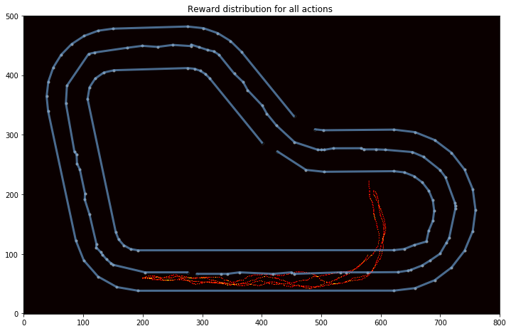

Validation Log

https://console.aws.amazon.com/cloudwatch/home?region=us-east-1#logStream:group=/aws/robomaker/SimulationJobs;prefix=sim-405mptmqggv4;streamFilter=typeLogStreamPrefix


# Train 11 - 술취함

차량이 시작부터 좌우로 심하게 움직이면서.. 마치 술취한 것 처럼 달림. 

이는.. 중심점에서 reward를 줬었는데.. 

throttle *0.5 를 하면서, 이 목표가 좀 희석됐다고 생각됨. 

좌우로~ 심하게 움직이면서 술취한것처럼 달림. 

목표를 일단 중심점에 놓아두는것이 첫번째가 되고, 

이후에 속도가 빠르면 reward를 거기에 더해서 좀 더 크게 주고, 

회전구간에서 제대로 좌우 핸들 틀면.. 더  reward를 주는 방식으로 가면 좋지 않을까 생각함. 

이때 중심으로 들어왔을때의 reward가 가장 커야하고.. 

그외는 조금 더 주는 방식? 비율을 좀 맞춰서. 


```
    def reward_function(self, on_track, x, y, distance_from_center, car_orientation, progress, steps,
                        throttle, steering, track_width, waypoints, closest_waypoints):
        
        msg = '[Anderson][04] on_track:{0} | xy:{1},{2} | dist:{3} | progress:{4} | steps:{5} | throttle:{6} | st:{7} | width:{8} | waypnt:{9} | clswp:{10} | '.format(
               on_track, x, y, round(distance_from_center, 2), round(progress, 2), steps, 
               throttle, steering, track_width, len(waypoints), closest_waypoints)
        
        import math
        from statistics import mean
        reward = 0

        if not on_track:
            return -0.1
        
        if distance_from_center >= 0.0 and distance_from_center <= 0.02:
            reward += 1
        elif distance_from_center >= 0.02 and distance_from_center <= 0.03:
            reward += 0.3
        elif distance_from_center >= 0.03 and distance_from_center <= 0.05:
            reward += 0.1
        
        reward -= distance_from_center
        reward += throttle * 0.5
        return reward/1000.
```

### Training

[Training Log](https://console.aws.amazon.com/cloudwatch/home?region=us-east-1#logStream:group=/aws/robomaker/SimulationJobs;prefix=sim-9h31h3fp4mm7;;streamFilter=typeLogStreamPrefix)


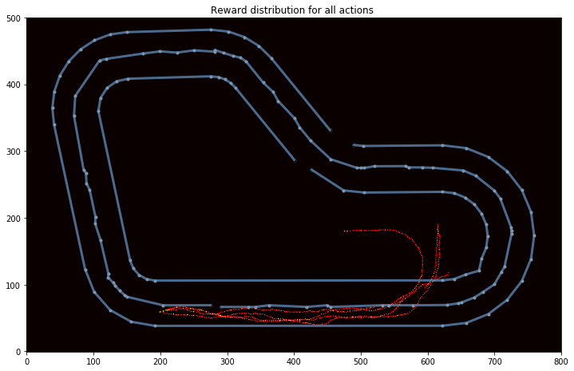


# Train 12 - 코너시 벽에 붙어감 그후 경기장 밖으로 아웃!

회전구간에서 지나치게 벽쪽에 붙어서 간다

첫번째 회전구간통과시 .. 거의 왼쪽 벽에 붙어서 움직인다. 

코너를 모두 돈후.. 직진차로에서 조금 더 가다가.. 좌측으로 조금 더 가서 아웃되면서 죽는다. 

left 를 꺽도록  steering을 할때마다 reward를 주었는데.. 이게 문제인듯 하다

무조건 left만 주면 reward를 좌측으로 꺽는데.. 또 나가면 안되니까.. 거의 벽에 붙어서 간다

steering의 범위를 지정해주는 것이 좋을듯 하다

예를 들어.. 

좌회전 구간에서 좌회전을 주면서 and distance_from_center <= 0.05 이하이면 reward를 주는 방식.. 

즉.. 중앙에서 너무 멀리 나가지 않으면서 좌회적을 하면.. reward를 받음. 

이런식으로 변화를 주면 좋지 않을까 생각됨

트릭 밖으로 나가면 -10으로 했는데. 원래 생각은 -10/100 할려고 했었는데. 깜빡 잊었음. 

```python
    def reward_function(self, on_track, x, y, distance_from_center, car_orientation, progress, steps,
                        throttle, steering, track_width, waypoints, closest_waypoint):
        
        import math
        from statistics import mean
        reward = 0
        rewards = []
        next_index = closest_waypoint + 1
        if next_index >= len(waypoints) -1:
            next_index = 0 

        current_waypoint = waypoints[closest_waypoint]
        next_waypoint = waypoints[next_index]
        
        msg = '[Anderson][04] on_track:{0} | xy:{1},{2} | dist:{3} | progress:{4} | steps:{5} | throttle:{6} | st:{7} | width:{8} | cur_wp:{9} {10} -> {11} {12} | car_orientation:{10} | '.format(
               on_track, x, y, round(distance_from_center, 2), round(progress, 2), steps, 
               throttle, steering, track_width, closest_waypoint, closest_waypoint, 
               next_index, next_waypoint, car_orientation)
        
        if not on_track:
            print(msg, 'Not On Track')
            return -10
        
        if distance_from_center >= 0.0 and distance_from_center <= 0.01:
            rewards.append('distance_from_center 0.01')
            reward += 10
        elif distance_from_center >= 0.1 and distance_from_center <= 0.02:
            rewards.append('distance_from_center 0.02')
            reward += 8
        elif distance_from_center >= 0.02 and distance_from_center <= 0.03:
            rewards.append('distance_from_center 0.03')
            reward += 5
        elif distance_from_center >= 0.03 and distance_from_center <= 0.05:
            rewards.append('distance_from_center 0.05')
            reward += 3
        
        if closest_waypoint == 0 and throttle >= 0.9:
            reward += 1
        elif closest_waypoint == 16 and throttle >= 0.9:
            reward += 1
        
        if closest_waypoint >= 1 and closest_waypoint <= 16 and steering > 0: # Left
            reward += 1
           
        if closest_waypoint >= 21 and closest_waypoint <= 27 and steering > 0: # Left
            reward += 1
            
        if closest_waypoint >= 28 and closest_waypoint <= 29 and steering > 0: # Left
            reward += 1
           
        if throttle >= 0.7:
            reward += 1
         
        reward = reward/100.
        print(msg, 'Reward:', reward)
        return reward
```

### Training


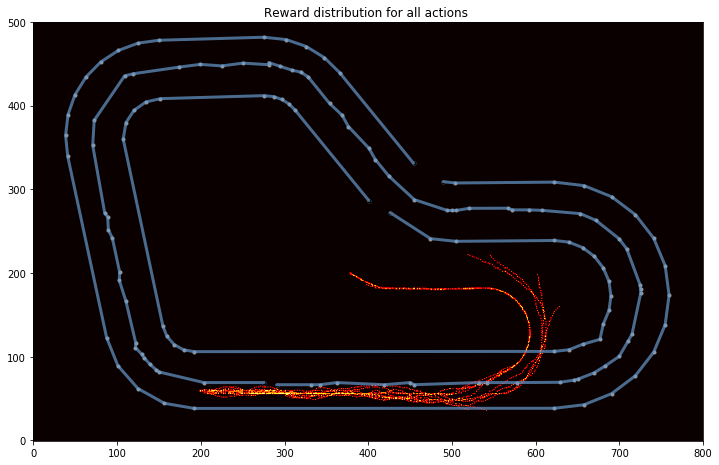

[Training Simulation Job](https://us-east-1.console.aws.amazon.com/robomaker/home?region=us-east-1#simulationJobs/sim-pt3dj26cf430)


# Train 13 - 기본 AWS reward 근데! 100 처럼 크게 줌! -> 결론 되던것도 안됨.

- eval episode 1: 첫번째 코너 돌다가. 크래쉬. 
- eval episode 2: 첫번째 코너 돌다가 또 크래쉬
- eval episode 3: 첫번째 코너 돌기전에 크래쉬 
- eval episode 4: 첫번째 코너 돌고.. 다 돈 이후.. 계속 직진하다 크래쉬
- eval episode 5: 4와 동일
- eval episode 6: 코너 돌기전에 크래쉬. 
- eval episode 7: 시작부터. 벽에 붙어서 아슬아슬하게 감.. 헐.. 코너를 도네..(차량이 1/3쯤 나간 상태로 계속 감) 다돌고 크래쉬

**결론.. 값을 크게주면.. 잘 되던것도 잘 안됨**

한번도 돈적이 없음.


```python
    def reward_function(self, on_track, x, y, distance_from_center, car_orientation, progress, steps,
                        throttle, steering, track_width, waypoints, closest_waypoints):
        if distance_from_center >= 0.0 and distance_from_center <= 0.02:
            return 100
        elif distance_from_center >= 0.02 and distance_from_center <= 0.03:
            return 30
        elif distance_from_center >= 0.03 and distance_from_center <= 0.05:
            return 1
        return 1e-3  # like crashed
```


# Train 14 


```python
def reward_function(self, on_track, x, y, distance_from_center, car_orientation, progress, steps,
                    throttle, steering, track_width, waypoints, closest_waypoint):
    
    import math
    from statistics import mean
    reward = 0
    rewards = []
    next_index = closest_waypoint + 1
    if next_index >= len(waypoints) -1:
        next_index = 0 

    current_waypoint = waypoints[closest_waypoint]
    next_waypoint = waypoints[next_index]
    
    msg = '[Anderson][04] xy:{1},{2} | cur_wp:{9} {10} -> {11} {12} | dist:{3} | progress:{4} | throttle:{6} | steps:{5} | st:{7} | width:{8} | car_orientation:{10} | on_track:{0} | '.format(
           on_track, x, y, round(distance_from_center, 2), round(progress, 2), steps, 
           throttle, steering, track_width, closest_waypoint, closest_waypoint, 
           next_index, next_waypoint, car_orientation)
           
    if not on_track:
        print(msg, 'Not On Track')
        return -1
    
    if distance_from_center > 0.07:
        print(msg, 'Far From Center', distance_from_center)
        return -1
    
    if distance_from_center >= 0.0 and distance_from_center <= 0.02:
        reward += 70
    elif distance_from_center >= 0.02 and distance_from_center <= 0.03:
        reward += 30
    elif distance_from_center >= 0.03 and distance_from_center <= 0.05:
        reward += 10
    
    if closest_waypoint in [0, 17, 18, 1] and y < 0.8: # 첫번째 직진 코스
        if throttle >= 0.9 and distance_from_center <= 0.02: # 직진코스에서 속도가 0.9 이상이라면 reward를 더 준다
            reward += 10
            
    if closest_waypoint >= 1 and closest_waypoint <= 16: # 첫번째 좌회전 코스
        if steering > 0 and distance_from_center <= 0.02: # 좌회전을 하되 중심에서 멀어지지 않았다면.. 
            reward += 10
    
    if closest_waypoint in [16, 17] and y > 1.9 and y < 2.1: # 두번째 직진 코스
        if throttle >= 0.9 and distance_from_center <= 0.02:
            reward += 5
    
    if closest_waypoint > 19 and closest_waypoint < 27: # 4번째 좌회전 구간
        if steering > 0 and distance_from_center <= 0.02: # 좌회전을 하되 중심에서 멀어지지 않았다면.. 
            reward += 5
    
    if x >= 0.6 and x <= 1.0 and closest_waypoint in [27, 28, 18]: # 마지막 직선
        if throttle >= 0.9 and distance_from_center <= 0.02:
            reward += 10
        
    print(msg, 'DEFAULT REWARD:', reward/100.)
    return reward/100.
```


### Training

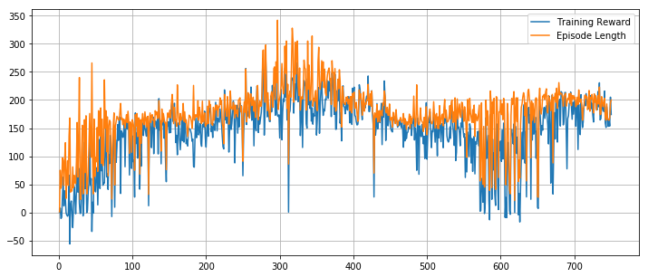

버그 찾았음.. 

아래 코드에서 not 이 붙어있어서.. 가까이 있을때 -1 reward가 들어갔음

```
if not distance_from_center > 0.07:
```


# JUDE Train 15

Closest waypoint를 찾아서 현재 위치에서 나아가야할 방향과 현재 위치에서의 헤딩을 비교해서 reward 세팅

현재 throttle에 대해서는 reward에 반영이 안되어 있음

```python
  def reward_function(self, on_track, x, y, distance_from_center, car_orientation, progress, steps,
                        throttle, steering, track_width, waypoints, closest_waypoints):   
    
        msg = '[jude][01] on_track:{0} | xy:{1},{2} | dist:{3} | progress:{4} | steps:{5} | throttle:{6} | st:{7} | width:{8} | waypnt:{9} | clswp:{10} | '.format(
          on_track, x, y, round(distance_from_center, 2), round(progress, 2), steps,
          throttle, steering, track_width, len(waypoints), closest_waypoints)

        import math
        from statistics import mean

       ##########
       # Settings
       ##########
       # Min / Max Reward
        REWARD_MIN = -1e5
        REWARD_MAX = 1e5

       ####################
       # Locations on track
       ####################

       # Set Base Reward
        if not on_track: # Fail them if off Track
            reward = REWARD_MIN
            return reward
        elif progress == 1:
            reward = 1
            return reward
        else:        # we want the vehicle to continue making progress
            reward = REWARD_MAX * progress

        s_id = 0
        next_id = 0

        if x >= waypoints[0,0] and x <= waypoints[1,0]:
            if abs(waypoints[0,1] - y) < 0.22:  # 1 s
                s_id = 1
                next_way = waypoints[1]
                next_id = 1
        elif x >=  waypoints[17,0] and x <= waypoints[16,0]:
            if abs(waypoints[17,1] - y) <= 0.22:  # 2 s
                s_id = 2
                next_way = waypoints[17]
                next_id = 17
            elif x >=  waypoints[19,0] and x <= waypoints[18,0]:
                if y >=  waypoints[16,1] and y <= waypoints[17,1]: # 3s
                    s_id = 3
                    next_way = waypoints[19]
                    next_id = 19
        elif x >=  waypoints[21,0] and x <= waypoints[20,0]:
            if abs(waypoints[20,1] - y) <= 0.3:  # 4 s
                s_id = 4
                next_way = waypoints[21]
                next_id = 21
        elif x >=  waypoints[27,0] and x <= waypoints[28,0]:
            if y >=  waypoints[28,1] and y <= waypoints[27,1]: # 5s
                s_id = 5
                next_way = waypoints[28]
                next_id = 28;

        if s_id > 0:  # 직선 구간 , throttle 고려
            dist = math.sqrt((next_way[0] - x)*(next_way[0] - x) + (next_way[1] - y)*(next_way[1] - y))
            if dist < 0.2:
                next_id  = next_id + 1
            next_heading = math.atan2(next_way[1]-y,next_way[0] - x)
        else: # 회전 구간
            min_dist = 10000
            tmp_id = 0
            for i in range(len(waypoints)):
                dist = math.sqrt((waypoints[i,0] - x)*(waypoints[i,0] - x) + (waypoints[i,1] - y)*(waypoints[i,1] - y))
                if dist <= min_dist:
                    min_dist = dist
                    tmp_id = i

            if tmp_id == 0 or tmp_id == 16 or tmp_id == 18 or tmp_id == 27:
                next_id = tmp_id
            elif tmp_id == 29:
                next_id = 0
            else:
                next_id = tmp_id+1

            next_way = waypoints[next_id]
            next_heading = math.atan2(next_way[1]-y,next_way[0] - x)


        reward = reward * (1-distance_from_center/track_width/2)

       # 현재 heading과 next heading의 차와 steering 비교
        steering_i = next_heading - car_orientation;
       #reward = reward * (1-abs(steering_i/pi))
        if steering * steering_i > 0: # correct control
            reward = reward * (1- (steering_i/math.pi * steering)*0.7)
        else: # wrong control
            reward  = reward * 0.1

       # normalize

        reward = reward/REWARD_MAX
        return reward
```

### Training

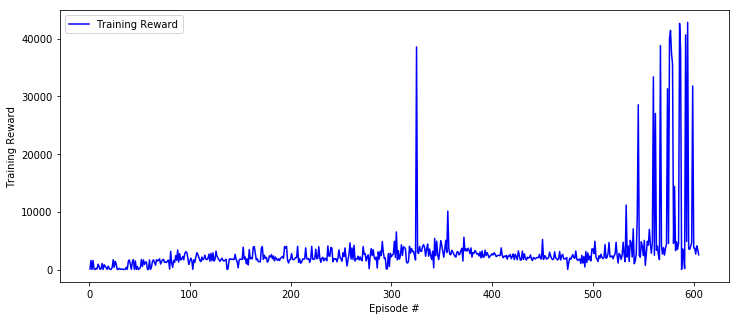

# Train 16 - 7번중에 1번정도 돌아감. 술취함

대충 7번중에 한번정도 돌아가는거 같음.. 아슬아슬하게 운전하고.. 

몇번은 초반 직선에서 시작하자마자 탈선함. 

[동영상](data/16-evaluation.mp4)

```python
    def reward_function(...):
        
        import math
        from statistics import mean
        reward = 0
        rewards = []
        next_index = closest_waypoint + 1
        if next_index >= len(waypoints) -1:
            next_index = 0 

        current_waypoint = waypoints[closest_waypoint]
        next_waypoint = waypoints[next_index]
        
        msg = '[Anderson][04] xy:{1},{2} | cur_wp:{9} {10} -> {11} {12} | dist:{3} | progress:{4} | throttle:{6} | steps:{5} | st:{7} | width:{8} | car_orientation:{10} | on_track:{0} | '.format(
               on_track, x, y, round(distance_from_center, 2), round(progress, 2), steps, 
               throttle, steering, track_width, closest_waypoint, closest_waypoint, 
               next_index, next_waypoint, car_orientation)
        
        if not on_track:
            print(msg, 'not on track')
            return -1
        
        print(msg, 'DEFAULT REWARD:', -1 * distance_from_center)
        
        return -1 * distance_from_center
```

### Training

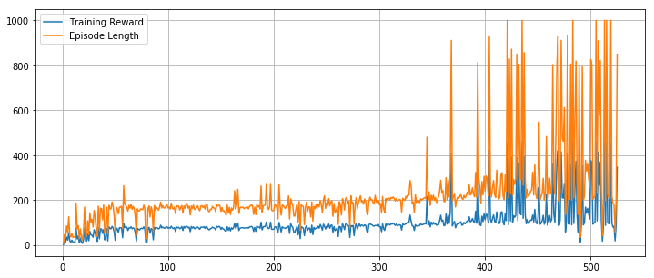

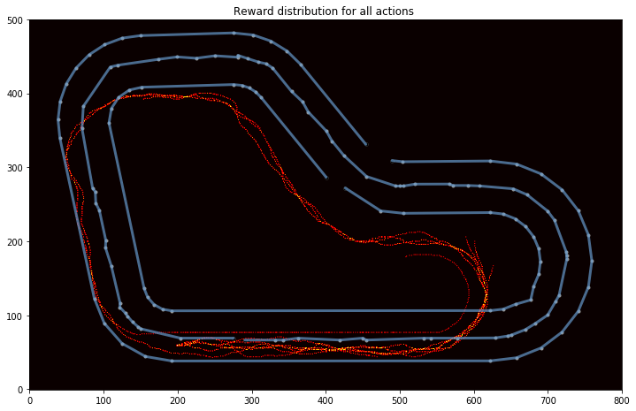

# Train 17 - 나름? 잘됨 | 실전 개안됨

if self._max_progress < progress 코드에 따라서 리워드를 주는 방식이 핵십이 되는 듯 하다. 

전에.. 이 코드를 빼고서 돌렸을때는.. 잘 안됨.. 그런데.. progress에 따른 리워드를 주자.. 어느정도 돌아감

그리고 progress 는 100넘을때 주는게 아니라.. 기록을 갱신하면 주는게 좋음

다음에는.. 좀더 시간을 늘려서 학습한다음에 해봐도 좋을듯

[비디오](./data/17-good.mp4)

```python
    def reward_function(...):
        """
        @param track_width = 0.44
        """
        
        import math
        from statistics import mean
        reward = 0
        rewards = []
        next_index = closest_waypoint + 1
        if next_index >= len(waypoints) -1:
            next_index = 0 

        current_waypoint = waypoints[closest_waypoint]
        next_waypoint = waypoints[next_index]
        
        msg = '[Anderson][04] xy:{1},{2} | cur_wp:{9} {10} -> {11} {12} | dist:{3} | progress:{4} | throttle:{6} | steps:{5} | st:{7} | width:{8} | car_orientation:{10} | on_track:{0} | reward episode:{13}'.format(
               on_track, x, y, round(distance_from_center, 2), round(progress, 2), steps, 
               throttle, steering, track_width, closest_waypoint, closest_waypoint, 
               next_index, next_waypoint, car_orientation, self.reward_in_episode)
        
        if not hasattr(self, '_max_progress'):
            self._max_progress = 0
           
        if not on_track:
            print(msg, 'NOT ON Track')
            return -1
        
        if distance_from_center > 0.05:
            print(msg, 'Distance From Center')
            return -1*distance_from_center
        
        if self._max_progress < progress:
            print(msg, 'Max Progress')
            self._max_progress = progress
            return 1
        
        print(msg, 'Default')
        return 1-distance_from_center
```

### 5 hour Training

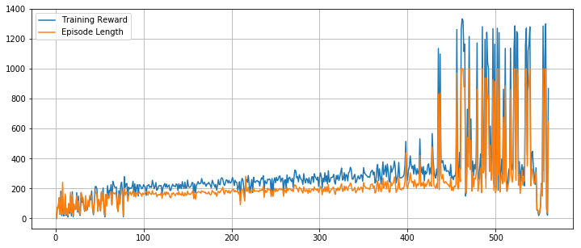


### 12 Hour Training


### 12 Hour Validation


# 18 초간단 - 실수반 돌아감반

대충 돌아감. 트랙 나가기도 하고.. 돌기도 하고.. 

[비디오](data/18-simple-validation-good.mp4)

```python
def reward_function(...):
        if not on_track:
            return -1
        
        return -1 * distance_from_center
```

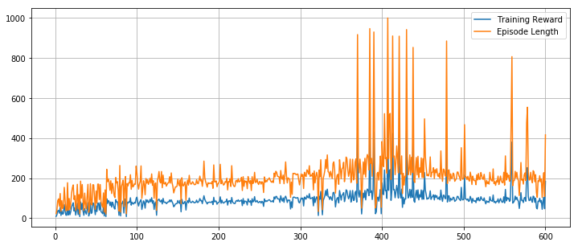

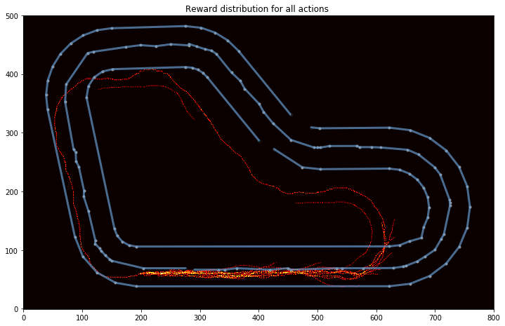

